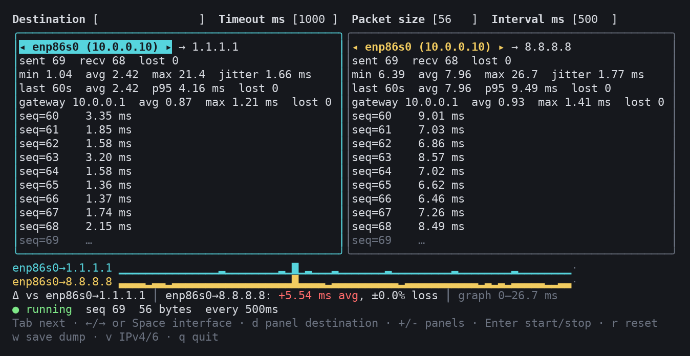
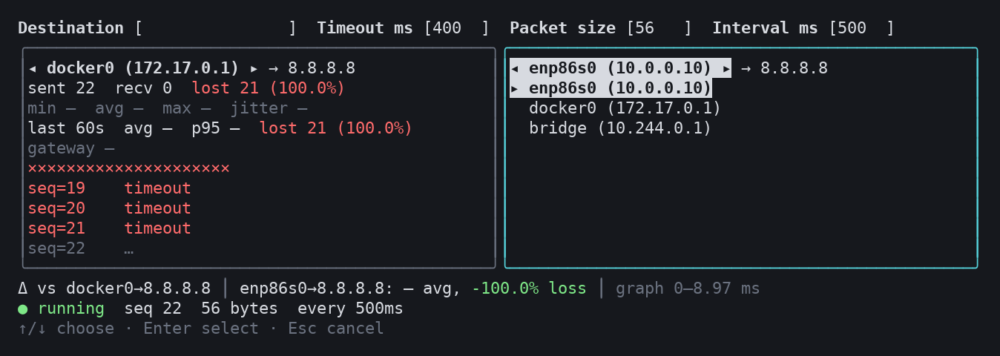

# multi-ping

Pings one destination through several network interfaces at the same time and
shows them side by side in the terminal, so you can see whether one interface
adds delay or loses packets.

Runs on Linux, macOS and Windows without root or administrator rights.
The Windows build compiles but has not been run yet; reports are welcome.



Each panel pings through one interface. Here both use the same interface with
different destinations; the line under the panels gives the difference from
the leftmost panel.



Picking an interface from the list. The left panel is an interface with no
route to the destination, so every ping is lost.

## Install

With Go 1.26 or newer:

```
go install github.com/kimonus/multi-ping@latest
```

Or from a checkout:

```
git clone https://github.com/kimonus/multi-ping.git
cd multi-ping
make build
```

On Linux the app needs unprivileged ICMP sockets, which current distributions
allow by default. If pings fail with "permission denied":

```
sudo sysctl -w net.ipv4.ping_group_range="0 2147483647"
```

## Run

```
multi-ping 8.8.8.8                      # start pinging right away
multi-ping                              # type the destination, press Enter
multi-ping -i eth0,wlan0 8.8.8.8        # one panel per listed interface
multi-ping -p 3 8.8.8.8                 # three panels instead of two
multi-ping -i eth0=8.8.8.8,eth0=10.0.0.1   # each panel with its own destination
multi-ping -list                        # usable interfaces, gateways, addresses
multi-ping -o log.csv 8.8.8.8           # also append every probe to a CSV file
multi-ping -o log.jsonl 8.8.8.8         # same, as JSON Lines
multi-ping -plain -c 10 8.8.8.8         # plain lines, no terminal UI
```

Other flags: `-t` timeout (ms), `-s` payload size (bytes), `-n` interval (ms),
`-6` prefer IPv6 for host names, `-no-gw` skip the gateway pings, `-keep`
probes kept in memory for dumps.

## Keys

| Key | Action |
|---|---|
| Tab / Shift+Tab | next / previous field or panel (also applies edited numbers) |
| ← / → | previous / next interface in the focused panel |
| Space or ↓ | open the interface list (↑/↓, Enter to pick, Esc to cancel) |
| d | give the focused panel its own destination (empty = back to the shared one) |
| + / - | add a panel / remove the focused panel (1 to 6 panels) |
| Enter | start / stop |
| r | reset statistics |
| w | save a dump of the current panels to `multi-ping-<date>-<time>.jsonl` |
| v | switch between IPv4 and IPv6 for host names that have both |
| q, Ctrl+C | quit |

Letter and `+`/`-` keys type text while the Destination field is focused; Tab
out of it first.

## Reading a panel

```
◂ wlan0 (192.168.1.20) ▸
sent 50  recv 42  lost 7 (14.3%)                  all-time counts
min 2.00  avg 49.0  max 96.0  jitter 2.29 ms      all-time round-trip times
last 60s  avg 49.0  p95 92.0 ms  lost 7 (14.3%)   the last minute only
gateway 192.168.1.1  avg 1.20  max 3.10 ms  lost 0
▁▁▂×▂▃▃×▄▅▅▆×▇██                                  one cell per probe, × = lost
seq=48    96.0 ms
```

- The address after `→` in a panel's title is what that panel pings: the
  shared Destination unless the panel was given its own.
- All sparklines share one scale, shown on the line under the panels.
- The line under the panels compares every panel with the leftmost one.
- The gateway line pings the interface's own IPv4 router at the same moments.
  A slow gateway points at the local link; a fast gateway with a slow
  destination points further upstream.
- Interfaces are re-read every two seconds. A panel whose interface vanishes
  is marked `down`, counts its probes as lost and resumes when it returns.

## Saved records

Dumps (`w`) and `.jsonl` logs use [JSON Lines](https://jsonlines.org): one
JSON object per line, told apart by `type`.

```
{"type":"session","format":1,"time":"2026-10-06T12:00:03Z","timeout_ms":1000,"size_bytes":56,"interval_ms":1000}
{"type":"summary","panel":1,"interface":"eth0","source":"10.0.0.10","kind":"destination","target":"8.8.8.8","sent":3,"recv":2,"lost":0,"loss_pct":0,"min_ms":10,"avg_ms":20,"max_ms":30,"jitter_ms":20}
{"type":"probe","time":"2026-10-06T12:00:00Z","panel":1,"interface":"eth0","kind":"destination","target":"8.8.8.8","seq":1,"status":"ok","rtt_ms":10}
{"type":"probe","time":"2026-10-06T12:00:01Z","panel":2,"interface":"wlan0","kind":"destination","target":"8.8.8.8","seq":1,"status":"timeout"}
```

- `kind` is `destination` or `gateway`; `status` is `ok`, `timeout` or `error`
  (with an `error` text). `rtt_ms` is present only for `ok`.
- A dump is a snapshot: one `session` line, a `summary` per panel and target,
  then the probes in time order. It covers what the panels hold since their
  last reset, at most 100,000 probes per panel and target (about 28 hours at
  one ping per second). `-keep N` changes that limit; `-keep 0` removes it.
- A `-o` log is written as probes finish and holds `probe` lines only, with
  no limit. Any other file extension gives CSV with the same fields.

Example: average round-trip time per interface with `jq`:

```
jq -s 'map(select(.type=="probe" and .status=="ok")) | group_by(.interface)
       | map({interface: .[0].interface, avg_ms: (map(.rtt_ms) | add / length)})' dump.jsonl
```

## Build

```
make build      # ./multi-ping for this machine
make test
make dist       # dist/ binaries for Linux, macOS and Windows (amd64, arm64)
```

The screenshots above come from the real program:

```
pip install pyte pillow
docs/screenshot.py docs/main.png 100x24 34 -- -n 500 -i eth0=1.1.1.1,eth0=8.8.8.8
docs/screenshot.py docs/interfaces.png 100x16 9 '\t ' -- -n 500 -t 400 -i docker0=8.8.8.8,eth0=8.8.8.8
```

## How it binds to an interface

| OS | Mechanism |
|---|---|
| Linux | unprivileged ICMP socket + `SO_BINDTODEVICE` (needs `net.ipv4.ping_group_range` to include your group, the default on current distributions) |
| macOS | unprivileged ICMP socket + `IP_BOUND_IF` / `IPV6_BOUND_IF` |
| Windows | `IcmpSendEcho2Ex` / `Icmp6SendEcho2` with the interface's address as source |

## License

[MIT](LICENSE)
